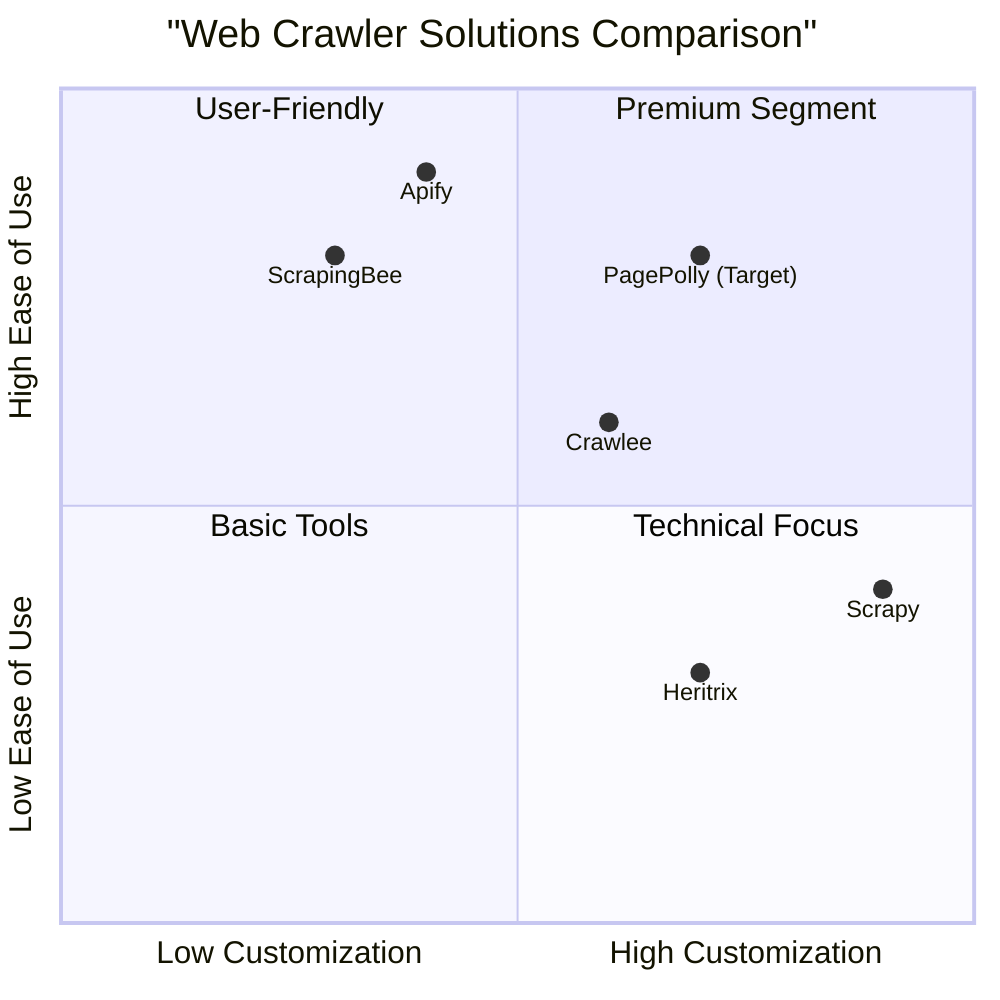
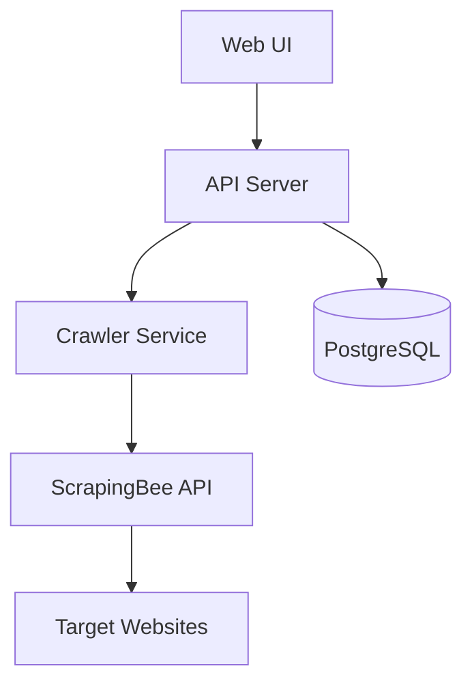

# PagePolly - Web Crawler and Dashboard Tool PRD

## 1. Project Overview

### 1.1 Project Information
- **Project Name**: page_polly
- **Programming Stack**: React, JavaScript, Web Components, Node.js, PostgreSQL
- **Original Requirements**: Build a web crawler tool using ScrapingBee API to monitor ~150 websites, extract text content, and provide a dashboard interface for monitoring supplier product listings.

### 1.2 Product Goals
1. Streamline supplier product monitoring through automated web crawling
2. Provide actionable insights through an intuitive dashboard interface
3. Maintain data integrity and historical tracking of supplier websites

### 1.3 User Stories
1. As a supplier manager, I want to monitor multiple supplier websites automatically so that I can ensure our products are listed correctly
2. As a content analyst, I want to view crawled data in an organized dashboard so that I can identify missing product listings
3. As an administrator, I want to manage the list of websites to crawl and crawling schedules so that I can maintain efficient monitoring
4. As a data analyst, I want to export crawled data and reports so that I can perform detailed analysis

### 1.4 Competitive Analysis

#### Market Solutions Comparison:

1. **ScrapingBee + Custom Solution**
- Pros:
  - Managed proxy infrastructure
  - Excellent documentation
  - CAPTCHA handling
  - API-first approach
- Cons:
  - Monthly costs
  - Limited customization

2. **Scrapy + Custom Dashboard**
- Pros:
  - Open-source
  - Highly customizable
  - Large community
- Cons:
  - Complex setup
  - Infrastructure management needed
  - Higher development effort

3. **Heritrix**
- Pros:
  - Web archiving focus
  - Built-in web interface
  - Extensible architecture
- Cons:
  - Java-based
  - Limited modern features
  - Complex deployment

4. **Crawlee**
- Pros:
  - Modern JavaScript-based
  - Good documentation
  - Active development
- Cons:
  - Newer project
  - Smaller community
  - Limited enterprise features

5. **Apify**
- Pros:
  - Full-featured platform
  - Integrated dashboard
  - SDK available
- Cons:
  - Expensive
  - Vendor lock-in
  - Limited customization

#### Competitive Positioning



## 2. Technical Specifications

### 2.1 System Architecture



### 2.2 Requirements Pool

#### P0 (Must-have)
- Web crawler integration with ScrapingBee API
- Basic dashboard with website list management
- Text content extraction (URLs, headings, paragraphs)
- PostgreSQL database integration
- Website monitoring status overview
- Manual crawl triggering
- Basic crawl scheduling

#### P1 (Should-have)
- Advanced scheduling options
- Data export functionality
- Search within crawled content
- Crawl history visualization
- Email notifications for issues
- Bulk website import/export
- Custom metadata fields

#### P2 (Nice-to-have)
- AI-powered content analysis
- Multiple crawler provider support
- Advanced reporting features
- API documentation
- User role management
- Custom alert rules
- Integration webhooks

### 2.3 UI Design Draft

#### Dashboard Layout
```
+----------------------------------------+
|            Navigation Bar               |
+----------------------------------------+
|          Quick Stats & Metrics         |
+----------------------------------------+
|                      |                 |
| Website List         | Crawl Status    |
|                      |                 |
|                      |                 |
+----------------------------------------+
|          Recent Activity Log           |
+----------------------------------------+
```

#### Key Screens
1. Dashboard Home
   - Overview metrics
   - Recent crawl activities
   - Alert notifications
   - Quick actions

2. Website Management
   - Website list view
   - Add/Edit website form
   - Bulk import/export
   - Status indicators

3. Crawl Results
   - Data grid view
   - Search/filter options
   - Export functionality
   - Timeline visualization

4. Settings
   - API configuration
   - Schedule management
   - Notification settings
   - User preferences

### 2.4 Database Schema

The provided PostgreSQL schema is suitable with minor enhancements:

```sql
-- Additional recommended fields for sites table
ALTER TABLE sites ADD COLUMN crawl_frequency INTERVAL;
ALTER TABLE sites ADD COLUMN last_successful_crawl TIMESTAMP;
ALTER TABLE sites ADD COLUMN status TEXT;

-- Additional recommended fields for crawled_pages table
ALTER TABLE crawled_pages ADD COLUMN meta_description TEXT;
ALTER TABLE crawled_pages ADD COLUMN meta_keywords TEXT;
ALTER TABLE crawled_pages ADD COLUMN content_hash TEXT;
```

## 3. Open Questions

1. **Technical Considerations**
   - What is the maximum concurrent crawl limit for ScrapingBee API?
   - How to handle rate limiting and scheduling for 150 websites?
   - What's the expected crawl frequency per website?

2. **Business Requirements**
   - What's the specific format for product detection rules?
   - Are there any compliance requirements for data storage?
   - What's the expected data retention period?

3. **Integration**
   - Are there any existing systems to integrate with?
   - What authentication system should be used?
   - What export formats are required?

## 4. Success Metrics

1. **Performance Metrics**
   - Crawler success rate > 95%
   - Average crawl completion time < 2 minutes
   - System uptime > 99.9%

2. **Business Metrics**
   - Reduction in manual monitoring time by 80%
   - Product listing compliance rate increase
   - Time to detect missing products < 24 hours

## 5. Timeline and Phases

### Phase 1 (MVP)
- Basic crawler implementation
- Essential dashboard features
- Website management
- Database integration

### Phase 2 (Enhanced Features)
- Advanced scheduling
- Reporting features
- Export functionality
- Email notifications

### Phase 3 (Advanced Features)
- AI analysis
- Multiple crawler support
- API documentation
- Custom integrations

## 6. Development Guidelines

### Technology Stack
- Frontend: React with Web Components
- Backend: Node.js
- Database: PostgreSQL
- API: RESTful with OpenAPI specification
- Crawler: ScrapingBee API

### Code Quality
- Follow JavaScript Standard Style
- Implement unit tests (>80% coverage)
- Use TypeScript for type safety
- Document all API endpoints
- Implement error handling and logging

### Repository Structure
```
page-polly/
├── client/           # Frontend React application
├── server/           # Node.js backend
├── database/         # Database migrations and seeds
├── docs/             # Documentation
└── docker/           # Docker configuration
```