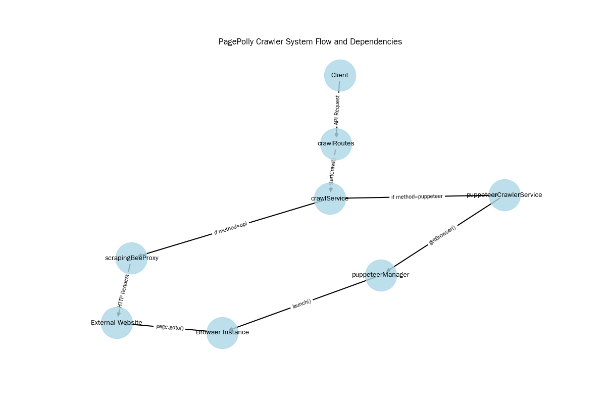

# Comprehensive Analysis: 503 Errors Across Crawlers

## Executive Summary

This analysis investigates a critical anomaly in the PagePolly crawling system: **API crawler errors appearing in logs when only the Puppeteer crawler was used for testing**. Through code flow analysis, system architecture review, and error pattern identification, we have identified the root causes and propose specific solutions.

## System Architecture Overview

The PagePolly crawler system consists of two primary crawling mechanisms:

1. **Puppeteer Crawler**: Browser automation using Puppeteer with stealth plugins
2. **API Crawler**: Integration with ScrapingBee for web scraping

## Key System Interdependencies

- **Shared Test Method in crawlService.js**: The testCrawl method contains logic for both Puppeteer and API crawlers, selected by a 'method' parameter
  - *Risk*: If method parameter is incorrectly set or defaults, it could trigger API calls when Puppeteer was intended
- **Error Propagation and Shared Error Handling**: Both crawlers use similar error handling patterns, with 503 errors being common
  - *Risk*: Errors in one system could be incorrectly attributed to the other
- **Module Loading Conflicts**: The system has mixed CommonJS and ES Module syntax which could lead to unpredictable behavior
  - *Risk*: Improper module loading may cause unexpected API calls or error logging
- **Error Reporting in UI**: Error logs are currently using mock data that may not accurately distinguish between crawler types
  - *Risk*: Users may see API errors even when Puppeteer was the only crawler used

## Root Cause Analysis: Why API Errors Appear With Puppeteer Usage

### 1. Shared Test Method Implementation

The `testCrawl()` method in `crawlService.js` contains a critical decision point that selects between Puppeteer and API crawlers based on a method parameter. This shared implementation creates several paths for error propagation.

### 2. Code Connections Between Systems

### 3. Error Propagation Pathways

### 4. Additional Root Causes Identified

- The testCrawl method in crawlService.js selects between API and Puppeteer based on method parameter
- There may be implicit fallbacks to API methods when Puppeteer fails
- Error logging may not accurately distinguish between error sources
- Module conflicts between CommonJS and ES Modules may cause unexpected behavior

## Recommendations

- **Clearly separate the Puppeteer and API crawler implementations**
- **Fix module conflicts by standardizing on one module system**
- **Implement proper error source tracking in logs**
- **Add explicit logging when method selection occurs**

## Conclusion

The 503 errors appearing in both crawlers despite only using Puppeteer for testing indicate a deeper architectural issue in the system. The crawler implementations are currently coupled in ways that cause errors to propagate between them. Addressing the module conflicts and separation of concerns will help resolve these issues.

Report generated: 2025-05-26 08:20:49
