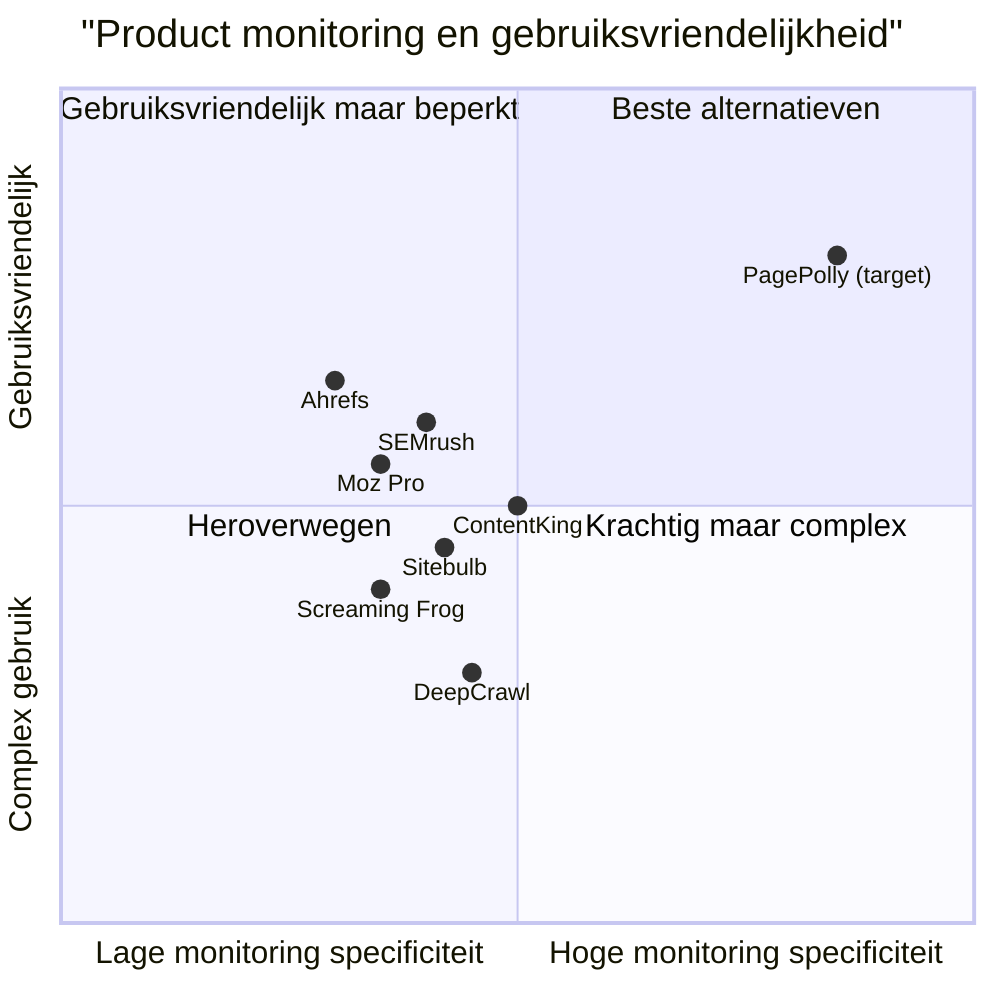

# Product Requirements Document: PagePolly

## 1. Inleiding

### 1.1 Projectoverzicht
**Projectnaam:** PagePolly  
**Programmeertaal:** React, JavaScript, Node.js  
**Repository:** https://github.com/Ollie-nl/PagePolly

### 1.2 Originele Vereisten
De ontwikkeling van een open source crawler-tool die leverancierswebsites controleert om vast te stellen of producten conform afspraak worden geplaatst. De tool crawlt de volledige pagina van een leverancier (de ingevoerde URL) en slaat alle relevante data op in een PostgreSQL-database. Via een eenvoudig te gebruiken React-dashboard worden de resultaten visueel gepresenteerd én is het in één oogopslag te volgen welke URL's al gecrawld zijn en wat de crawlvoortgang (in percentage) is. Het project wordt beheerd op GitHub, zodat er altijd controle gehouden wordt en er flexibel kan worden ingespeeld op toekomstige wensen.

## 2. Product Definitie

### 2.1 Productdoelen
1. **Websitecontrole:** Een betrouwbaar systeem bieden dat automatisch leverancierswebsites controleert op correcte productplaatsing, waarmee handmatige inspectie wordt geëlimineerd en de efficiency wordt verhoogd.
2. **Datavisualisatie:** Real-time inzicht bieden in de resultaten van website-crawls via een intuïtief dashboard, waardoor afwijkingen snel kunnen worden geïdentificeerd en opgelost.
3. **Flexibele Infrastructuur:** Een goed gedocumenteerde, aanpasbare architectuur leveren die eenvoudig kan worden uitgebreid of aangepast aan toekomstige bedrijfsbehoeften.

### 2.2 User Stories
1. **Als een productmanager** wil ik leverancierswebsites kunnen monitoren zodat ik kan controleren of onze producten correct worden weergegeven en gepromoot.
2. **Als een marketingcoördinator** wil ik kunnen zien welke leveranciers onze producten niet of incorrect tonen zodat ik gerichte follow-up acties kan ondernemen.
3. **Als een systeembeheerder** wil ik eenvoudig URL's kunnen toevoegen, bewerken en verwijderen zodat het systeem up-to-date blijft met onze huidige leveranciersrelaties.
4. **Als een data-analist** wil ik duidelijke visuele representaties van de crawlresultaten kunnen bekijken zodat ik trends en problemen snel kan identificeren.
5. **Als een niet-technische gebruiker** wil ik intuïtieve documentatie hebben over het configureren van crawl-proxy's zodat ik aanpassingen kan maken zonder ontwikkelaarsondersteuning.

### 2.3 Concurrentieanalyse

| Product | Voordelen | Nadelen |
|---------|-----------|--------|
| **Screaming Frog** | Uitgebreide crawling mogelijkheden; Gedetailleerde rapportage | Geen specifieke productplaatsing monitoring; Desktop applicatie in plaats van web-gebaseerd; Steile leercurve |
| **SEMrush** | Uitgebreide SEO-toolset; Goede visualisaties | Niet specifiek gericht op productplaatsing; Duur abonnementsmodel; Beperkte aanpasbaarheid |
| **Ahrefs** | Sterke backlink analyse; Gebruiksvriendelijke interface | Niet ontworpen voor productplaatsing controle; Hoge kosten; Beperkte crawl frequentie |
| **DeepCrawl** | Uitgebreide website-audit functies; Cloud-gebaseerd | Complex voor eenvoudige use cases; Kostenstructuur per crawl; Niet specifiek voor productcontrole |
| **Moz Pro** | Goede rapportagefuncties; SEO-inzichten | Primair gericht op SEO, niet op productplaatsing; Beperkte aanpasbaarheid; Subscription-based |
| **Sitebulb** | Intuïtieve visualisaties; Gedetailleerde HTML-analyse | Desktop-gebaseerd; Gericht op technische SEO; Geen specifieke productmonitoring |
| **ContentKing** | Real-time monitoring; Alertsysteem | Algemene webpagina monitoring in plaats van specifieke productplaatsing; Prijzig voor veel URL's |

### 2.4 Competitive Quadrant Chart



## 3. Technische Specificaties

### 3.1 Vereistenanalyse
PagePolly moet een oplossing bieden die specifiek is ontworpen voor het controleren van productplaatsing op leverancierswebsites. Het systeem moet een volledig webbased oplossing zijn die bestaat uit:

1. **Frontend**: Een React-gebaseerd dashboard met intuïtieve gebruikersinterface
2. **Backend**: Een Node.js API-laag voor server-side logica en database-interactie
3. **Database**: PostgreSQL database voor gestructureerde dataopslag
4. **Externe Integratie**: Gebruik van externe Crawl API's voor het ophalen van webpagina-inhoud
5. **Veiligheid**: Beveiligingsmechanismen voor API keys en andere gevoelige gegevens

Het systeem moet volledig aanpasbaar zijn, goed gedocumenteerd, en voorbereid zijn op toekomstige uitbreidingen zoals een login-systeem.

### 3.2 Vereistenoverzicht

#### 3.2.1 Frontend Vereisten

**P0 (Must-have):**
- Een React-dashboard met responsive design voor verschillende schermformaten
- Beheerinterface voor het toevoegen, bewerken en verwijderen van leveranciers-URL's
- Visualisatie van crawlresultaten in tabel- en grafiekvorm
- Voortgangsindicatoren per URL (percentage gecrawld)
- Totaaloverzicht van crawlvoortgang voor alle URL's

**P1 (Should-have):**
- Filtermogelijkheden voor URL's en crawlresultaten
- Exportfuncties voor rapporten (PDF, CSV)
- Thematische dashboards gebaseerd op specifieke productcategorieën
- Geavanceerde visualisaties van trends en statistieken

**P2 (Nice-to-have):**
- Aangepaste waarschuwingen bij afwijkingen
- Vergelijkingsfunctionaliteit tussen verschillende timeframes
- Whitelist/blacklist functionaliteit voor specifieke URL-patronen

#### 3.2.2 Backend Vereisten

**P0 (Must-have):**
- Node.js API-laag voor communicatie tussen frontend en database
- Integratie met externe Crawl API's
- Foutafhandeling en logging
- Beveiligde opslag van gevoelige gegevens (.env-bestanden)

**P1 (Should-have):**
- API rate limiting en caching
- Mogelijkheden voor parallelle verwerking van crawls
- Geautomatiseerd back-up systeem voor de database

**P2 (Nice-to-have):**
- API documentatie via Swagger of vergelijkbaar
- Ondersteuning voor meerdere parallelle crawl-providers
- Webhooks voor integratie met externe systemen

#### 3.2.3 Database Vereisten

**P0 (Must-have):**
- PostgreSQL database implementatie volgens het gespecificeerde schema
- Indexering voor optimale query prestaties
- Referentiële integriteit tussen tabellen

**P1 (Should-have):**
- Database migratie systeem voor versiecontrole
- Archivering van historische data

**P2 (Nice-to-have):**
- Schaalbaarheidsoptimalisaties voor grote datasets
- Uitgebreide statistieken en query-analyses

#### 3.2.4 Externe Crawling Vereisten

**P0 (Must-have):**
- Integratie met tenminste één externe Crawl API (bijv. ScrapingBee)
- Configureerbare crawler instellingen via .env bestanden
- Complete documentatie over het gebruik van de Crawl API

**P1 (Should-have):**
- Failover mechanisme tussen verschillende crawl-providers
- Mogelijkheid om crawl-frequentie en timing in te stellen

**P2 (Nice-to-have):**
- Automatische selectie van optimale crawl-provider gebaseerd op prestatie
- A/B testing van verschillende crawl-configuraties

#### 3.2.5 Veiligheidsmaatregelen

**P0 (Must-have):**
- Beveiligde opslag van API keys en credentials
- Input validatie en sanitization
- Implementatie van Node.js beveiligingsbest practices

**P1 (Should-have):**
- Rate limiting op API endpoints
- Gedetailleerde toegangslogboeken

**P2 (Nice-to-have):**
- Voorbereidingen voor toekomstige authenticatie en autorisatie
- IP-gebaseerde toegangsbeperking

### 3.3 UI Design Concept

#### 3.3.1 Dashboard Hoofdscherm
```
+-------------------------------------------------------------+
|                         PAGEPOLLY                           |
+----------------------+---------------------------------------|                          
| MENU                 |            OVERZICHT                 |
|                      |                                       |
| [] Dashboard         | Totale Voortgang:  [======75%======] |
| [] Leveranciers      |                                       |
| [] Rapporten         | URL's gecrawld: 45/60                 |
| [] Instellingen      |                                       |
|                      | +------------------------------+      |
|                      | |        Snelle Statistieken   |      |
|                      | | - Foutieve URL's: 3          |      |
|                      | | - Ontbrekende producten: 7   |      |
|                      | | - Gemiddelde response: 1.2s  |      |
|                      | +------------------------------+      |
|                      |                                       |
|                      | [Crawl starten] [Exporteren]          |
+----------------------+---------------------------------------+
|                      RECENTE ACTIVITEIT                      |
+-------------------------------------------------------------+
|  Datum    |   URL   | Status | Producten | Duur | Acties    |
+----------+---------+--------+-----------+------+------------+
| 16-04-25 | site1.. | ✓ 200 |    12/12  | 1.3s | [Details]  |
| 16-04-25 | site2.. | ✓ 200 |    9/10   | 0.9s | [Details]  |
| 16-04-25 | site3.. | ✗ 404 |    0/8    | 0.4s | [Details]  |
+-------------------------------------------------------------+
```

#### 3.3.2 Leveranciersbeheer Scherm
```
+-------------------------------------------------------------+
|                         PAGEPOLLY                           |
+----------------------+---------------------------------------|                          
| MENU                 |         LEVERANCIERS BEHEER          |
|                      |                                       |
| [] Dashboard         | [+ NIEUWE LEVERANCIER TOEVOEGEN]      |
| [] Leveranciers      |                                       |
| [] Rapporten         | Zoeken: [                      ]      |
| [] Instellingen      |                                       |
|                      | +-------------------------------+     |
|                      | |   LEVERANCIERS OVERZICHT      |     |
|                      | +-------------------------------+     |
|                      | | Naam  | URL  | Status | Acties |     |
|                      | |-------|------|--------|--------|     |
|                      | | Lev 1 | http | Actief | [⚙️][🗑️] |     |
|                      | | Lev 2 | http | Actief | [⚙️][🗑️] |     |
|                      | | Lev 3 | http | Inactief| [⚙️][🗑️] |    |
|                      | +-------------------------------+     |
+----------------------+---------------------------------------+
|                     STATUS: 24 ACTIEVE LEVERANCIERS          |
+-------------------------------------------------------------+
```

#### 3.3.3 Detailrapportage Scherm
```
+-------------------------------------------------------------+
|                         PAGEPOLLY                           |
+----------------------+---------------------------------------|                          
| MENU                 |        RAPPORT: LEVERANCIER X         |
|                      |                                       |
| [] Dashboard         | URL: https://leverancier-x.nl/products |
| [] Leveranciers      | Laatste crawl: 16-04-2025 14:30       |
| [] Rapporten         | Status: Succesvol (200 OK)            |
| [] Instellingen      |                                       |
|                      |      [Exporteren] [Opnieuw crawlen]    |
|                      |                                       |
|                      | +------------------------------+      |
|                      | |    PRODUCTRESULTATEN         |      |
|                      | +------------------------------+      |
|                      | | Product | Gevonden | Correct |      |
|                      | |---------|----------|---------|      |
|                      | | Prod A  |    ✓     |    ✓    |      |
|                      | | Prod B  |    ✓     |    ✗    |      |
|                      | | Prod C  |    ✗     |    -    |      |
|                      | +------------------------------+      |
+----------------------+---------------------------------------+
|                     CRAWL DETAILS                            |
+-------------------------------------------------------------+
| Response time: 1.3s | Memory used: 14.2MB | Crawler: API v1.2|
+-------------------------------------------------------------+
```

### 3.4 Open Vragen

1. **Crawl Planning:** Moet de tool mogelijkheden bieden voor geplande, automatische crawls, of alleen handmatige triggering?

2. **Productherkenningsmechanisme:** Welke specifieke criteria of kenmerken worden gebruikt om te bepalen of een product correct geplaatst is? (tekstuele match, afbeeldingsherkenning, etc.)

3. **Schaalbaarheid:** Wat is het verwachte volume van te crawlen URL's? Is er een maximaal aantal leveranciers voorzien?

4. **Notificaties:** Moeten er automatische alerts of notificaties zijn wanneer producten niet of incorrect worden weergegeven?

5. **Extra functies:** Is er behoefte aan prijsmonitoring, naast het controleren van de aanwezigheid van producten?

6. **Gebruikersrollen:** Zijn er verschillende typen gebruikers die toegang nodig hebben tot het systeem met verschillende permissies?

7. **Prestatievereisten:** Zijn er specifieke requirements voor de snelheid van crawlen of rapporteren?

8. **Compliance:** Zijn er juridische overwegingen met betrekking tot het crawlen van leverancierswebsites (bijv. robots.txt compliance)?

## 4. Implementatie Roadmap

### 4.1 Fase 1: MVP (Minimum Viable Product)

**Week 1-2: Database & Backend Setup**
- PostgreSQL database opzetten volgens gespecificeerd schema
- Node.js API-structuur implementeren
- Externe Crawl API integratie

**Week 3-4: Frontend Basis**
- React project setup met dashboard basisstructuur
- URL beheer interface
- Eenvoudige visualisatie van crawl-resultaten

**Week 5-6: Core Functionaliteiten**
- Complete crawl workflow implementatie
- Basis rapportages en statistieken
- Eerste versie documentatie

### 4.2 Fase 2: Uitgebreide Functionaliteiten

**Week 7-8: Geavanceerd Dashboard**
- Uitgebreide visualisaties en grafieken
- Verbeterd filtering- en zoeksysteem
- Export functionaliteiten

**Week 9-10: Verbeterde Crawling**
- Ondersteuning voor meerdere externe crawl-providers
- Failover mechanismen
- Performance optimalisaties

**Week 11-12: Documentatie & Testen**
- Uitgebreide gebruikersdocumentatie
- Technische documentatie voor ontwikkelaars
- Uitgebreide tests en bugfixes

### 4.3 Fase 3: Toekomstige Uitbreidingen

**Beveiliging & Autorisatie**
- Login systeem implementatie
- Gebruikersrollen en permissies
- Toegangscontrole tot rapporten en instellingen

**Geavanceerde Analyse**
- Machine learning voor anomaliedetectie
- Predictieve analyses voor trendvoorspelling
- Geautomatiseerde rapportage en alerting

**Externe Integraties**
- API's voor integratie met andere systemen (CRM, ERP)
- Webhooks voor real-time notificaties
- Mobiele app voor onderweg monitoring

## 5. Conclusie

PagePolly biedt een gespecialiseerde oplossing voor het monitoren en controleren van product plaatsing op leverancierswebsites. Door gebruik te maken van moderne web technologieën zoals React, Node.js en PostgreSQL, gecombineerd met externe crawling diensten, levert het systeem een krachtige maar gebruiksvriendelijke oplossing voor productmanagers en marketingteams.

De open-source aard van het project, gecombineerd met de uitgebreide documentatie, zorgt ervoor dat de tool flexibel en aanpasbaar blijft voor toekomstige behoeften. Door te focussen op een intuïtief dashboard en heldere visualisaties kunnen gebruikers van verschillende technische niveaus effectief met het systeem werken.

De initiële MVP zal de kernfunctionaliteiten leveren voor URL-beheer, crawling en basisrapportage, met een duidelijke roadmap voor toekomstige uitbreidingen zoals geavanceerde analyses en een volledig login-systeem.