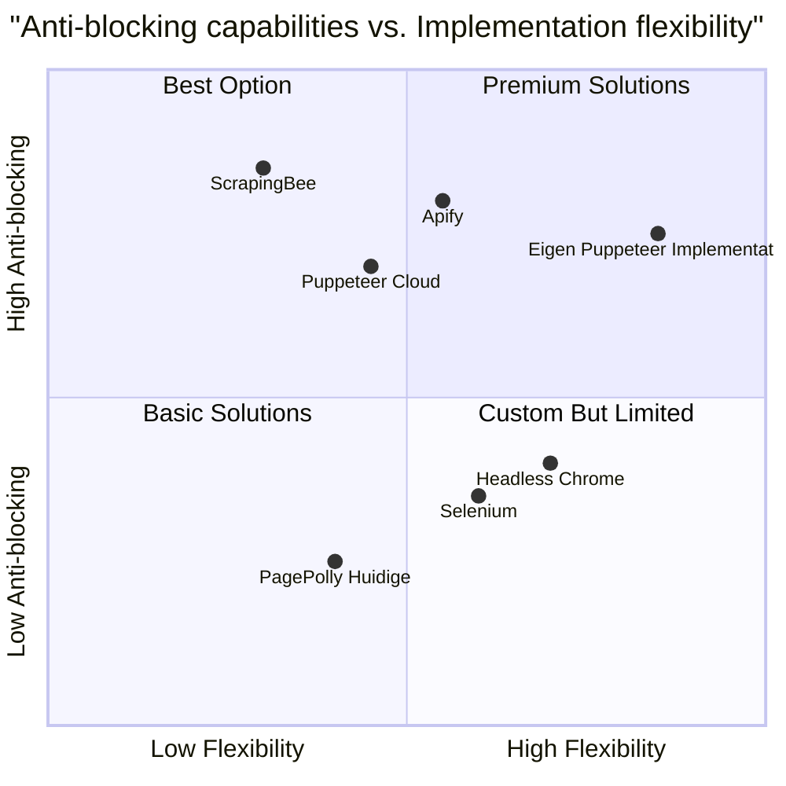

# PagePolly Puppeteer Implementation Plan - PRD

## 1. Inleiding

Dit document beschrijft het plan om de huidige crawling methode in PagePolly te vervangen door een Puppeteer-gebaseerde oplossing die effectieve anti-blocking mechanismen implementeert. De huidige aanpak resulteert in 503 fouten, wat wijst op detectie en blokkering door websites.

### 1.1 Achtergrond

PagePolly is een open-source web crawler ontworpen om vendor websites te monitoren voor correcte productrepresentatie. De tool crawlt opgegeven URL's en slaat tekstinhoud, links en metadata op in een Supabase PostgreSQL database. Gebruikers kunnen crawl-resultaten visualiseren via een React-gebaseerd dashboard.

### 1.2 Huidige Uitdagingen

- 503 fouten bij het crawlen wijzen op anti-bot maatregelen die de huidige crawler detecteren
- De bestaande implementatie is mogelijk niet voldoende geavanceerd om moderne detectiemethoden te omzeilen
- Betrouwbaarheid van datacollectie wordt aangetast door blokkeringen

## 2. Productdefinitie

### 2.1 Productdoelen

1. De huidige crawling-methode vervangen door een robuuste Puppeteer-implementatie die effectief anti-blocking technieken toepast
2. De betrouwbaarheid van de datacollectie verhogen door blokkeringen te minimaliseren en succespercentages te verhogen naar >95%
3. Een flexibele en onderhoudbare architectuur creëren die gemakkelijk kan worden uitgebreid met nieuwe anti-blocking strategieën

### 2.2 User Stories

1. Als beheerder wil ik crawl-jobs kunnen configureren met verschillende anti-blocking instellingen, zodat ik de crawler kan optimaliseren voor verschillende websites
2. Als gebruiker wil ik betrouwbare crawling-resultaten ontvangen zonder 503 fouten, zodat ik accurate productdata kan monitoren
3. Als productmanager wil ik inzicht hebben in crawl-statistieken en succespercentages, zodat ik de effectiviteit van de crawler kan meten
4. Als developer wil ik nieuwe anti-blocking strategieën kunnen toevoegen zonder de core code te wijzigen, zodat de crawler up-to-date blijft met nieuwe detectietechnieken

### 2.3 Concurrentie-analyse

| Product | Voor- en nadelen | Prijs | Opmerkingen |
|---------|-----------------|-------|-------------|
| ScrapingBee | + Beheerde proxy-rotatie<br>+ Anti-detectie ingebouwd<br>- Extern afhankelijk<br>- Kostbaar bij grote volumes | €49-€499/maand | Momenteel geïntegreerd maar levert 503 fouten |
| Puppeteer Cloud | + Serverless<br>+ Schaalbaar<br>- Minder fine-tuning opties<br>- Vereist cloud platform | Variabel (AWS) | Vereist AWS Lambda |
| Apify | + Uitgebreid ecosystem<br>+ Anti-detectie tools<br>- Externe afhankelijkheid<br>- Relatief hoge kosten | €49-€499/maand | Biedt SDK maar vereist hun platform |
| Headless Chrome | + Direct controle<br>+ Gratis en open-source<br>- Vereist eigen hosting<br>- Meer beheerwerk | Gratis | Basis voor Puppeteer |
| Selenium | + Breed gedragen<br>+ Geschikt voor testen<br>- Trager dan Puppeteer<br>- Zwaarder resource gebruik | Gratis | Meer focus op testing dan scraping |
| Eigen Puppeteer Implementatie | + Volledige controle<br>+ Kostenefficiënt<br>+ Aanpasbaar<br>- Vereist onderhoud<br>- Initiële ontwikkeltijd | Ontwikkelkosten | Voorgestelde oplossing |

### 2.4 Concurrentie-kwadrant



## 3. Technische Specificaties

### 3.1 Vereistenanalyse

#### Functionele Vereisten
- Puppeteer-gebaseerde crawling implementatie die bestaande interfaces behoudt
- Anti-blocking mechanismen zoals user-agent rotatie, proxy-rotatie, en random delays
- Geavanceerde browser fingerprinting preventie
- Menselijk-achtige interactie simulatie (scrollen, muisbewegingen)
- Configureerbare crawl-instellingen per website/vendor
- Resultatenopslag in Supabase met consistente datastructuren

#### Niet-functionele Vereisten
- Performance: Minimale overhead door Puppeteer-implementatie (max 20% langzamer dan huidige crawler)
- Betrouwbaarheid: >95% succes ratio op websites met anti-bot maatregelen
- Onderhoudbaarheid: Modulair ontwerp met duidelijke scheiding van verantwoordelijkheden
- Schaalbaarheid: Ondersteuning voor parallel crawlen zonder overbelasting

### 3.2 Vereistenpool

| ID | Beschrijving | Prioriteit |
|----|-------------|------------|
| R1 | Implementeer basis Puppeteer crawler die compatibel is met bestaande crawlService | P0 |
| R2 | Integreer anti-blocking technieken (user-agent rotatie, random delays) | P0 |
| R3 | Implementeer browser fingerprinting bescherming (canvas, WebGL, etc.) | P0 |
| R4 | Ontwikkel configuratie interface voor crawler instellingen per website | P1 |
| R5 | Zorg voor proxy-rotatie ondersteuning | P1 |
| R6 | Implementeer menselijk-achtige interacties (scrollen, muisbewegingen) | P1 |
| R7 | Maak crawl-statistieken dashboard voor anti-blocking effectiviteit | P1 |
| R8 | Ontwikkel retry-mechanisme met exponentiële back-off voor geblokkeerde requests | P0 |
| R9 | Bouw geautomatiseerde tests voor crawler effectiviteit | P2 |
| R10 | Optimaliseer resource gebruik (geheugen, CPU) | P2 |

### 3.3 Architectuurontwerp

#### Componenten

1. **PuppeteerManager**: Beheert Puppeteer browser instances en pagina's
   - Browser pool beheer
   - Instellingen configuratie
   - Resource optimalisatie

2. **AntiDetectionService**: Implementeert anti-detection technieken
   - User agent rotatie
   - Browser fingerprinting bescherming
   - Proxy-rotatie
   - Timing variatie

3. **HumanBehaviorSimulator**: Simuleert menselijk gedrag
   - Scrollen
   - Muisbewegingen
   - Natuurlijke navigatie

4. **CrawlerEngine**: Core crawling logica
   - URL verwerking
   - Content extractie
   - Error handling

5. **DataPersistenceService**: Slaat crawl resultaten op
   - Supabase integratie
   - Schema mapping
   - Data validatie

#### Datamodellen

```javascript
// CrawlerConfig Model
{
  id: string,
  vendorId: string,
  userEmail: string,
  settings: {
    userAgentRotation: boolean,
    proxyRotation: boolean,
    useProxies: string[],
    minDelay: number,
    maxDelay: number,
    simulateHumanBehavior: boolean,
    maxRetries: number,
    allowedDomains: string[],
    excludePatterns: string[]
  },
  createdAt: timestamp,
  updatedAt: timestamp
}

// CrawlResult Model (compatible with existing schema)
{
  id: string,
  url: string,
  vendorId: string,
  sessionId: string,
  userEmail: string,
  status: string,
  data: {
    title: string,
    content: string,
    metadata: Object,
    links: Array,
    structure: Object
  },
  screenshot: string,  // base64
  timestamp: timestamp,
  crawlDuration: number,
  retryCount: number,
  success: boolean,
  errorMessage: string
}
```

### 3.4 UI Design Concept

#### Crawler Configuratiescherm

- Sectie voor basis crawler instellingen
  - Max pagina's per run
  - Crawl vertraging (min/max)
  - Toegestane domeinen
  - Exclude patronen

- Sectie voor anti-blocking instellingen
  - User agent rotatie (aan/uit + lijst)
  - Browser fingerprinting bescherming (aan/uit)
  - Menselijk gedrag simulatie (aan/uit)
  - Gedetailleerde timing opties
  
- Sectie voor proxy-instellingen
  - Proxy rotatie (aan/uit)
  - Proxy lijst beheer
  - Test proxy-verbinding

#### Crawl Statistieken Dashboard

- Grafiek voor succespercentage over tijd
- Breakdown van fouten per type (503, timeout, etc.)
- Vergelijking tussen verschillende anti-blocking configuraties
- Heat map van geblokkeerde sites vs. succesvolle crawls

## 4. Implementatieplan

### 4.1 Fase 1: Core Puppeteer Implementatie (Week 1-2)

- Architectuur setup en basis componenten
- Puppeteer integratie in bestaande crawlService
- Browser en page management implementatie
- Basis content extractie methoden

### 4.2 Fase 2: Anti-Detection Technieken (Week 3-4)

- User agent rotatie
- Browser fingerprinting bescherming via stealth plugin
- Random delays en timing variatie
- Retry-logica met exponentiële back-off

### 4.3 Fase 3: Geavanceerde Features (Week 5-6)

- Menselijk gedrag simulatie
- Proxy rotatie integratie
- Configuratie interface
- Performance optimalisatie

### 4.4 Fase 4: Testen en Verfijning (Week 7-8)

- Geautomatiseerde tests voor verschillende websites
- A/B testen van verschillende anti-blocking strategieën
- Performance benchmarking
- Bugfixing en optimalisatie

## 5. Open Vragen

1. Is er een voorkeur voor specifieke proxyproviders om te integreren?
2. Welke specifieke websites veroorzaken momenteel de meeste 503 fouten?
3. Is er een budget voor externe diensten zoals proxy pools?
4. Bestaat er een voorkeur voor containerization (Docker) van de Puppeteer implementatie?
5. Moeten we de bestaande ScrapingBee integratie behouden als fallback?

## 6. Technische Implementatie Details

### 6.1 Core Puppeteer Anti-Detection Setup

```javascript
const puppeteer = require('puppeteer-extra');
const StealthPlugin = require('puppeteer-extra-plugin-stealth');
const AdblockerPlugin = require('puppeteer-extra-plugin-adblocker');

// Add stealth plugin and adblocker
puppeteer.use(StealthPlugin());
puppeteer.use(AdblockerPlugin({ blockTrackers: true }));

class PuppeteerManager {
  constructor(config = {}) {
    this.config = {
      maxConcurrent: config.maxConcurrent || 5,
      userAgents: config.userAgents || DEFAULT_USER_AGENTS,
      minDelay: config.minDelay || 1000,
      maxDelay: config.maxDelay || 5000,
      ...config
    };
    this.browserPool = [];
  }

  async getBrowser() {
    if (this.browserPool.length < this.config.maxConcurrent) {
      const browser = await puppeteer.launch({
        headless: 'new',
        args: [
          '--no-sandbox',
          '--disable-setuid-sandbox',
          '--disable-infobars',
          '--window-position=0,0',
          '--ignore-certificate-errors',
          '--ignore-certificate-errors-spki-list',
          `--window-size=${1366 + Math.floor(Math.random() * 100)},${768 + Math.floor(Math.random() * 100)}`
        ]
      });
      this.browserPool.push(browser);
      return browser;
    }
    
    // Return random browser from pool
    return this.browserPool[Math.floor(Math.random() * this.browserPool.length)];
  }

  async getPage() {
    const browser = await this.getBrowser();
    const page = await browser.newPage();
    
    // Apply anti-detection measures
    await this.applyAntiDetection(page);
    return page;
  }

  async applyAntiDetection(page) {
    // Random user agent
    const userAgent = this.config.userAgents[Math.floor(Math.random() * this.config.userAgents.length)];
    await page.setUserAgent(userAgent);

    // Set viewport with slight randomization
    await page.setViewport({
      width: 1366 + Math.floor(Math.random() * 100),
      height: 768 + Math.floor(Math.random() * 100)
    });

    // Set WebGL vendor and renderer
    await page.evaluateOnNewDocument(() => {
      const getParameter = WebGLRenderingContext.getParameter;
      WebGLRenderingContext.prototype.getParameter = function(parameter) {
        // UNMASKED_VENDOR_WEBGL
        if (parameter === 37445) {
          return 'Intel Inc.';
        }
        // UNMASKED_RENDERER_WEBGL
        if (parameter === 37446) {
          return 'Intel Iris OpenGL Engine';
        }
        return getParameter.call(this, parameter);
      };
    });

    // Cookie handling improvements
    await page.setCookie({
      name: 'session-id',
      value: `${Math.random().toString(36).substring(2, 15)}`,
      domain: '.example.com',
      path: '/',
      expires: Date.now() / 1000 + 60 * 60 * 24 // 1 day
    });

    return page;
  }

  async randomDelay() {
    const delay = Math.floor(Math.random() * 
      (this.config.maxDelay - this.config.minDelay + 1) + this.config.minDelay);
    await new Promise(resolve => setTimeout(resolve, delay));
  }

  async simulateHumanBehavior(page) {
    // Random scrolling
    await page.evaluate(() => {
      const totalHeight = document.body.scrollHeight;
      let scrollPosition = 0;
      const scrollStep = Math.floor(Math.random() * 100) + 50;
      
      return new Promise(resolve => {
        const scrollInterval = setInterval(() => {
          window.scrollBy(0, scrollStep);
          scrollPosition += scrollStep;
          
          if (scrollPosition >= totalHeight) {
            clearInterval(scrollInterval);
            resolve();
          }
        }, Math.floor(Math.random() * 300) + 100);
      });
    });

    // Random mouse movements
    const viewportWidth = page.viewport().width;
    const viewportHeight = page.viewport().height;
    
    // Move to random positions
    for (let i = 0; i < 5; i++) {
      const x = Math.floor(Math.random() * viewportWidth);
      const y = Math.floor(Math.random() * viewportHeight);
      await page.mouse.move(x, y, { steps: Math.floor(Math.random() * 10) + 5 });
      await this.randomDelay();
    }
  }

  async cleanup() {
    for (const browser of this.browserPool) {
      await browser.close();
    }
    this.browserPool = [];
  }
}

module.exports = PuppeteerManager;
```

### 6.2 Integration with Existing CrawlService

```javascript
const PuppeteerManager = require('./PuppeteerManager');
const { v4: uuidv4 } = require('uuid');
const db = require('../config/db');

class CrawlService {
  constructor() {
    // Store active crawl jobs
    this.activeJobs = new Map();
    this.puppeteerManager = new PuppeteerManager();
  }

  // ... bestaande code ...

  async executeCrawl(jobId) {
    const job = this.activeJobs.get(jobId);
    if (!job) {
      throw new Error(`Job ${jobId} not found`);
    }

    try {
      // Update status to running
      this.updateJobStatus(jobId, 'running');

      // Process each URL
      const results = [];
      for (let i = 0; i < job.urls.length; i++) {
        if (job.status === 'cancelled') {
          break;
        }

        const url = job.urls[i];
        try {
          // Apply exponential backoff for retries
          const result = await this.crawlWithRetry(url, job.vendor?.settings || {});
          results.push({ url, ...result });
          
          // Update progress
          const progress = Math.floor(((i + 1) / job.urls.length) * 100);
          this.updateJobProgress(jobId, progress);
        } catch (error) {
          job.errors.push({ url, error: error.message });
          await db.recordCrawlError(jobId, url, error.message);
        }
      }

      // Store results if job wasn't cancelled
      if (job.status !== 'cancelled') {
        job.results = results;
        job.completionTime = new Date();
        job.status = 'completed';
        
        // Save final results to database
        await db.updateCrawlJob(jobId, {
          status: 'completed',
          progress: 100,
          results,
          completionTime: job.completionTime
        });
      }
    } catch (error) {
      // Handle any errors in the crawling process
      this.updateJobStatus(jobId, 'failed', { error: error.message });
      await db.updateCrawlJob(jobId, {
        status: 'failed',
        error: error.message
      });
    }
  }

  async crawlWithRetry(url, settings = {}) {
    const maxRetries = settings.maxRetries || 3;
    let retryCount = 0;
    let lastError;

    while (retryCount < maxRetries) {
      try {
        // Get page with anti-detection applied
        const page = await this.puppeteerManager.getPage();

        // Add random delay before request
        await this.puppeteerManager.randomDelay();

        // Attempt to crawl
        const result = await this.crawlSinglePage(page, url, settings);
        await page.close();
        return {
          ...result,
          retryCount,
          success: true
        };
      } catch (error) {
        lastError = error;
        retryCount++;
        console.log(`Retry ${retryCount}/${maxRetries} for ${url}: ${error.message}`);
        
        // Exponential backoff
        const backoffTime = Math.pow(2, retryCount) * 1000 + Math.floor(Math.random() * 1000);
        await new Promise(resolve => setTimeout(resolve, backoffTime));
      }
    }

    throw new Error(`Failed after ${maxRetries} retries: ${lastError.message}`);
  }

  async crawlSinglePage(page, url, settings = {}) {
    // Customize request interception based on settings
    await page.setRequestInterception(true);
    page.on('request', (req) => {
      // Skip loading unnecessary resources
      const resourceType = req.resourceType();
      if (settings.blockResources?.includes(resourceType) || 
          ['image', 'media', 'font', 'stylesheet'].includes(resourceType)) {
        req.abort();
      } else {
        req.continue();
      }
    });

    try {
      // Navigate to URL with timeout
      await page.goto(url, { 
        waitUntil: settings.waitUntil || 'domcontentloaded', 
        timeout: settings.timeout || 30000 
      });
      
      // Wait for content to load
      await page.waitForSelector('body', { timeout: 5000 });

      // Optionally simulate human behavior if enabled in settings
      if (settings.simulateHumanBehavior) {
        await this.puppeteerManager.simulateHumanBehavior(page);
      }

      // Extract page information (unchanged from existing implementation)
      const pageData = await page.evaluate(() => {
        // ... existing data extraction code ...
      });
      
      // Take a screenshot
      const screenshot = await page.screenshot({ 
        fullPage: true,
        encoding: 'base64',
        quality: 80,
        type: 'jpeg'
      });
      
      // Return the collected data
      return { 
        data: pageData, 
        screenshot: `data:image/jpeg;base64,${screenshot}`,
        timestamp: new Date()
      };
    } catch (error) {
      throw error;
    }
  }

  // ... rest of existing service methods ...
}

module.exports = new CrawlService();
```

### 6.3 Schema Aanpassingen voor Supabase

```sql
-- Aanpassingen aan bestaande crawler_settings tabel
ALTER TABLE pagepolly_x65isd_crawler_settings
ADD COLUMN IF NOT EXISTS anti_blocking_settings JSONB DEFAULT '{}'::JSONB;

COMMENT ON COLUMN pagepolly_x65isd_crawler_settings.anti_blocking_settings IS 
'Anti-blocking configuratie inclusief user agent rotatie, proxy instellingen en timing parameters';

-- Aanpassingen aan bestaande crawler_results tabel
ALTER TABLE pagepolly_x65isd_crawler_results
ADD COLUMN IF NOT EXISTS retry_count INT DEFAULT 0,
ADD COLUMN IF NOT EXISTS success BOOLEAN DEFAULT true,
ADD COLUMN IF NOT EXISTS crawl_duration INT,
ADD COLUMN IF NOT EXISTS blocking_detected BOOLEAN DEFAULT false,
ADD COLUMN IF NOT EXISTS block_type VARCHAR(50);

COMMENT ON COLUMN pagepolly_x65isd_crawler_results.retry_count IS 'Aantal retries voor succesvolle crawl';
COMMENT ON COLUMN pagepolly_x65isd_crawler_results.success IS 'Of de crawl succesvol was';
COMMENT ON COLUMN pagepolly_x65isd_crawler_results.crawl_duration IS 'Duur van de crawl in ms';
COMMENT ON COLUMN pagepolly_x65isd_crawler_results.blocking_detected IS 'Of blocking gedetecteerd is';
COMMENT ON COLUMN pagepolly_x65isd_crawler_results.block_type IS 'Type blocking (503, captcha, etc)';
```

## 7. Conclusie

De implementatie van Puppeteer met geavanceerde anti-blocking technieken zal PagePolly's crawling mogelijkheden significant verbeteren. Door de huidige aanpak die resulteert in 503 fouten te vervangen met een robuuste oplossing, verwachten we een aanzienlijke verbetering in betrouwbaarheid en datakwaliteit.

De gedetailleerde technische implementatie maakt gebruik van best practices voor web crawling en anti-detection, waaronder user agent rotatie, browser fingerprinting bescherming, en menselijk gedrag simulatie. Het modulaire ontwerp zorgt voor eenvoudige uitbreidbaarheid en onderhoud.

Het voorgestelde plan kan binnen 8 weken worden geïmplementeerd, met een incrementele aanpak die zorgt voor voortdurende functionaliteit tijdens de transitie. De eerste werkende versie met basis Puppeteer integratie en anti-blocking maatregelen kan binnen 4 weken worden opgeleverd.